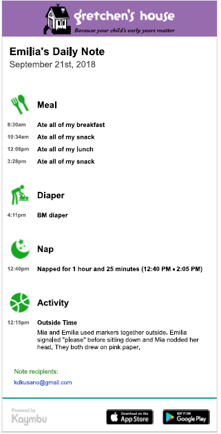

# AWS Lambda for Parsing Kaymbu Daily Notes

This project is to use an AWS lambda to parse daily note emails from Kaymbu
into a database that can be visualized.

## Making Lambda Deployment Package
The python lambda environment has limited packages available.
Therefore, a deployment package has to be made with all dependent libraries included.
One problem, however, is that some packages (such as `lxml`) are compiled against
  machine specific libraries.
*Solution*: Docker. Amazon released their AWS linux image for docker, so
we can make the deployment package that way.

To make the deployment package (`deploy.zip`), run `deploy.bat` on Windows
(the same commands should work on Linux/Mac also)
